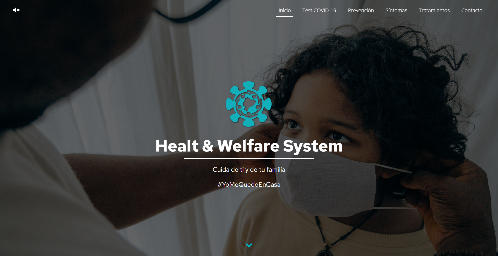
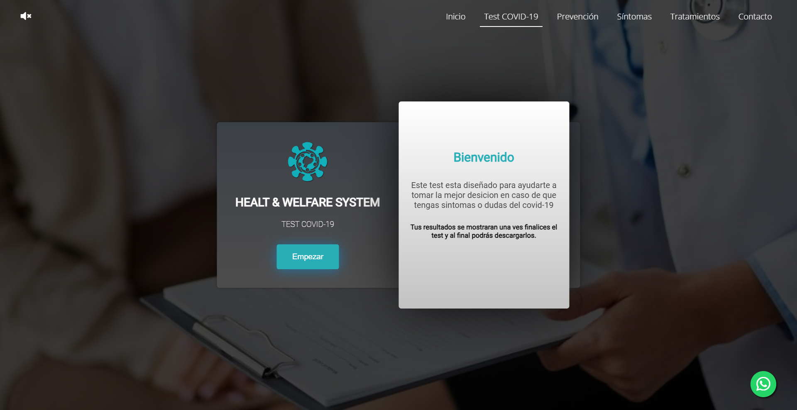
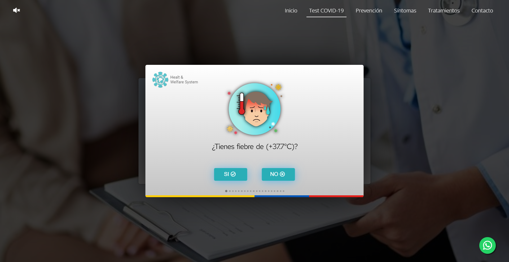
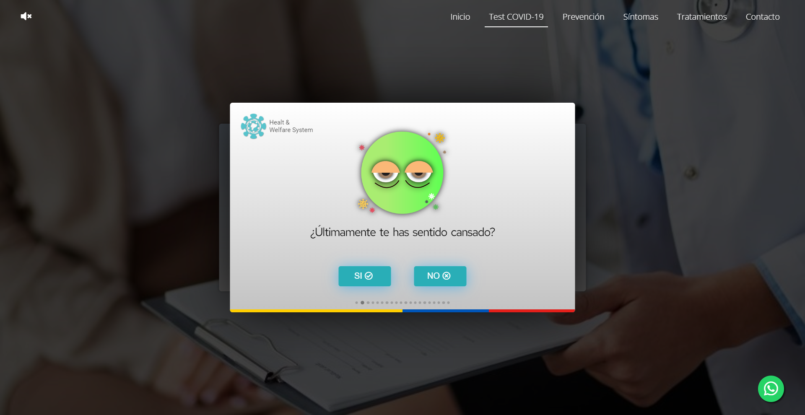
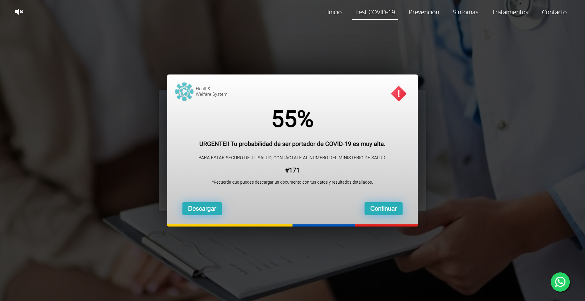

# Healt-Welfare-System

  

Un sistema de bienestar y salud que proporciona herramientas para monitorear y mejorar la salud personal. Este proyecto ofrece funciones como seguimiento de actividad física, registro de comidas, recordatorios de medicamentos y análisis de datos de salud.

## Capturas de Pantalla

<table style="width: 100%;">
  <tr>
    <td align="center">
      
       
      Página de inicio
    </td>
    <td align="center">
      
       
      Funciones de seguimiento
    </td>
  </tr>
  <tr>
    <td align="center">
      
       
      Asistente de voz
    </td>
    <td align="center">
      
       
      Registro de comidas
    </td>
  </tr>
  <tr>
    <td align="center">
      
       
      Recordatorios de medicamentos
    </td>
    <td align="center">
      
       
      Análisis de datos de salud
    </td>
  </tr>
</table>

## Archivo de Resultados del Test

El archivo de resultados del test de COVID-19 se encuentra disponible para su descarga en formato PDF.

- [Descargar Resultados del Test de COVID-19](img/capturas/resultados-test.pdf)

## Tecnologías Utilizadas

- HTML
- CSS
- JavaScript

## Instalación

1. Clona este repositorio en tu máquina local.
2. Navega hasta la carpeta raíz del proyecto.
3. Abre el archivo `index.html` en tu navegador web preferido.

## Estructura del Proyecto

La estructura del proyecto se muestra a continuación:

- **css**: Carpeta que contiene archivos CSS utilizados para estilos y diseño del sitio web.

- **html**: Carpeta que contiene archivos HTML que definen el contenido y estructura de las páginas web.

- **img**: Carpeta que almacena imágenes utilizadas en el sitio web, como logotipos, ilustraciones y fotografías.

- **js**: Carpeta que contiene archivos JavaScript para agregar funcionalidad interactiva al sitio web.

- **sound**: Carpeta que almacena archivos de sonido o audio utilizados en el sitio web, como efectos de sonido o pistas de audio.

## Uso

1. Abre el sitio web en tu navegador web visitando `http://localhost:8000` después de iniciar el servidor local.
2. Explora la información sobre el Covid-19 en las diferentes secciones del sitio web.
3. Accede a la aplicación de prueba desde el menú o enlace correspondiente.
4. Responde las preguntas sobre tus síntomas y factores de riesgo.
5. Al finalizar, recibirás un porcentaje de probabilidad de tener Covid-19.

## Inclusión

El sitio web se enfoca en la inclusión y accesibilidad, y cuenta con un asistente de voz integrado que brinda instrucciones y guía en cada paso del test y en la navegación de la página.

## Contribución

¡Gracias por considerar contribuir a este proyecto! Si deseas enviar una solicitud de extracción, asegúrate de seguir estas pautas:

1. Crea una rama específica para tu contribución.
2. Asegúrate de que todas las pruebas pasen antes de enviar la solicitud de extracción.
3. Describe claramente los cambios realizados y explica su propósito.
4. Mantén las líneas de código dentro de los límites de estilo establecidos en el proyecto.

## Contacto

Si tienes alguna pregunta o comentario sobre el proyecto, no dudes en ponerte en contacto con nosotros a través de jav.tanicuchi@yavirac.edu.ec.

