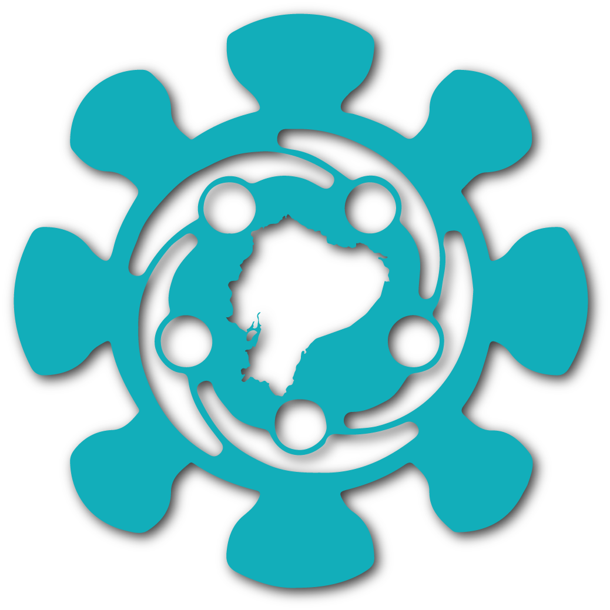

# Healt-Welfare-System

Un sistema de bienestar y salud que proporciona herramientas para monitorear y mejorar la salud personal. Este proyecto ofrece funciones como seguimiento de actividad física, registro de comidas, recordatorios de medicamentos y análisis de datos de salud.

## Capturas de Pantalla

## Tecnologías Utilizadas

- HTML
- CSS
- JavaScript

## Instalación

1. Clona este repositorio en tu máquina local.
2. Navega hasta la carpeta raíz del proyecto.
3. Abre el archivo `index.html` en tu navegador web preferido.

## Estructura del Proyecto

La estructura del proyecto se muestra a continuación:

├── css
│ ├── styles.css
│ └── ...
├── html
│ ├── index.html
│ └── ...
├── img
├── js
│ ├── app.js
│ └── ...
├── sound
│ └── ...
└── ...

## Uso

1. Abre el sitio web en tu navegador web visitando `http://localhost:8000` después de iniciar el servidor local.
2. Explora la información sobre el Covid-19 en las diferentes secciones del sitio web.
3. Accede a la aplicación de prueba desde el menú o enlace correspondiente.
4. Responde las preguntas sobre tus síntomas y factores de riesgo.
5. Al finalizar, recibirás un porcentaje de probabilidad de tener Covid-19.

## Contribución

¡Gracias por considerar contribuir a este proyecto! Si deseas enviar una solicitud de extracción, asegúrate de seguir estas pautas:

1. Crea una rama específica para tu contribución.
2. Asegúrate de que todas las pruebas pasen antes de enviar la solicitud de extracción.
3. Describe claramente los cambios realizados y explica su propósito.
4. Mantén las líneas de código dentro de los límites de estilo establecidos en el proyecto.

## Contacto

Si tienes alguna pregunta o comentario sobre el proyecto, no dudes en ponerte en contacto con nosotros a través de jav.tanicuchi@yavirac.edu.ec.

